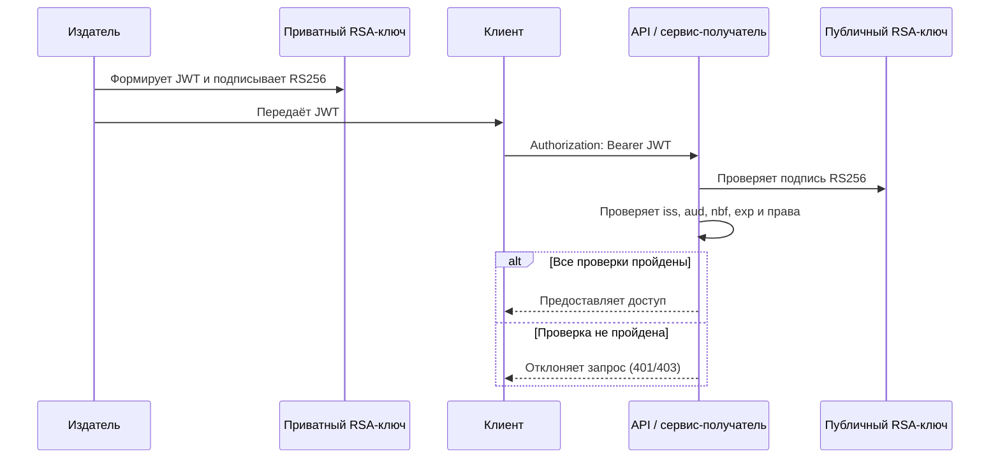
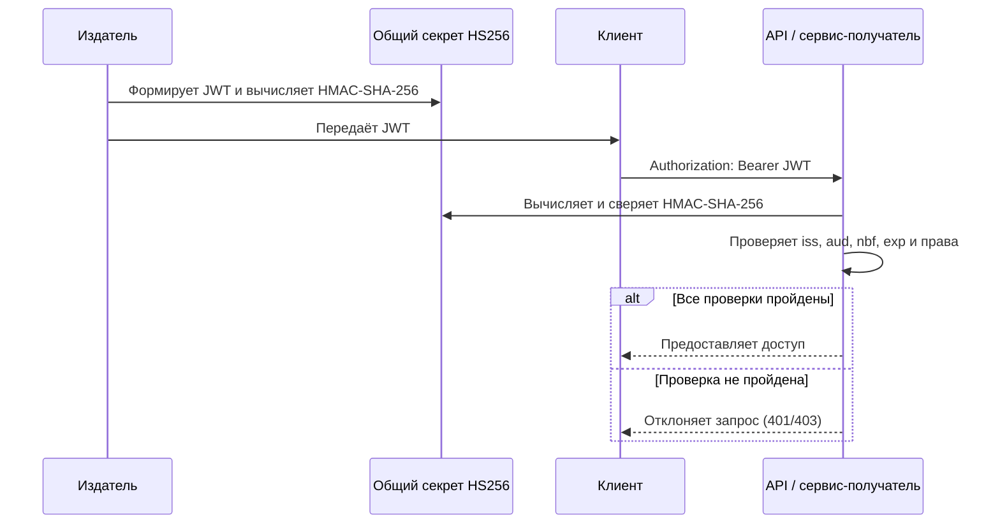

# Схема работы JWT

JWT (JSON Web Token) — компактный формат для передачи набора утверждений (claims) между сторонами. Подписанный JWT подтверждает целостность данных и того, кто владеет ключом подписи, но не скрывает эти данные: заголовок и payload доступны для чтения любому, у кого есть токен.

## Формат токена

JWT состоит из трёх частей, разделённых точками:

```text
base64url(заголовок).base64url(полезная_нагрузка).base64url(подпись)
```

Логическая структура токена:

```json
{
  "alg": "RS256 или HS256",
  "typ": "JWT"
}
.
{
  "iss": "https://issuer.example",
  "aud": "https://api.example",
  "sub": "user-123",
  "role": "admin",
  "iat": 1788940800,
  "nbf": 1788940800,
  "exp": 1788944400
}
.
подпись
```

Заголовок и payload кодируются Base64URL, а не шифруются. Поэтому в claims нельзя передавать пароли, персональные данные и другие секреты. Для сокрытия содержимого нужен отдельный механизм шифрования, например JWE.

## Claims

| Claim | Назначение |
| --- | --- |
| `iss` | Идентификатор издателя токена. |
| `aud` | Идентификатор получателя, для которого предназначен токен. |
| `sub` | Субъект токена, например идентификатор пользователя. |
| `iat` | Время выпуска токена (UTC Unix time). |
| `nbf` | Токен нельзя принимать до указанного момента. |
| `exp` | Токен нельзя принимать после указанного момента. |
| пользовательские claims | Роли, разрешения и другие данные, необходимые получателю. |

Получающий сервис обязан проверять подпись, разрешённый алгоритм, `iss`, `aud`, `nbf`, `exp` и claims, важные для авторизации. Наличие этих полей в токене без проверки не создаёт ограничений само по себе.

## RS256

`RS256` — асимметричный алгоритм подписи RSA с хешированием SHA-256. Издатель подписывает токен приватным RSA-ключом, а получатель проверяет его соответствующим публичным ключом.



### Когда использовать

RS256 удобен, когда токены выпускает один центр авторизации, а проверяют несколько независимых сервисов: публичный ключ можно безопасно распространить между проверяющими сервисами, не давая им права выпускать токены. Для ротации нескольких ключей обычно добавляют в заголовок `kid`, а публичные ключи публикуют через JWKS.

Приватный ключ должен оставаться только у издателя. Для RSA рекомендуется использовать ключи длиной не менее 2048 бит.

## HS256

`HS256` — симметричный алгоритм HMAC с SHA-256. Один и тот же общий секрет используется и для выпуска, и для проверки токена.



### Когда использовать

HS256 подходит для ограниченного числа доверенных компонентов, которые могут и выпускать, и проверять токены, например для одного сервиса или небольшой закрытой системы.

Секрет нельзя передавать клиентам и нельзя публиковать. Любой сервис, получивший секрет HS256, технически способен не только проверить, но и создать действительный токен. Поэтому HS256 не подходит, если сервисам нужна только проверка без права выпуска токенов; в таком случае предпочтителен RS256.

Секрет должен быть криптографически случайным, достаточно длинным и храниться в защищённом хранилище секретов. Не используйте короткие строки, пароли или значения из исходного кода.

## Ротация и отзыв

Подпись защищает токен от изменения, но не решает задачу немедленного отзыва. Обычно используют короткий срок действия `exp`; при необходимости добавляют серверную проверку списка отозванных `jti`, версии сессии или состояния пользователя.

При ротации RS256 выпускают новую пару RSA-ключей и на переходный период разрешают проверку текущим и предыдущим публичными ключами. При ротации HS256 новый общий секрет необходимо согласованно установить у издателя и всех получателей. `kid` в заголовке JWT помогает определить, каким ключом или секретом проверять токен, но сам по себе не является секретом и не заменяет проверку подписи.

## Используемые стандарты

- [RFC 7519 — JSON Web Token (JWT)](https://www.rfc-editor.org/rfc/rfc7519): формат токена и зарегистрированные claims.
- [RFC 7515 — JSON Web Signature (JWS)](https://www.rfc-editor.org/rfc/rfc7515): компактная сериализация и цифровая подпись JWT.
- [RFC 7518 — JSON Web Algorithms (JWA)](https://www.rfc-editor.org/rfc/rfc7518): `RS256` (RSA с SHA-256) и `HS256` (HMAC с SHA-256).
- [RFC 4648, раздел 5](https://www.rfc-editor.org/rfc/rfc4648#section-5): кодирование Base64URL.
- [RFC 7517 — JSON Web Key (JWK)](https://www.rfc-editor.org/rfc/rfc7517): формат публичных ключей, применяемый в JWKS.
